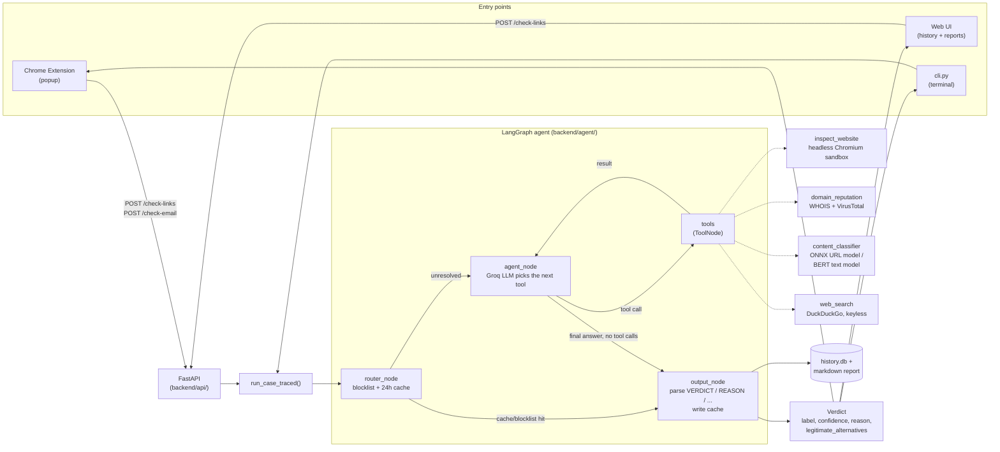

# security-copilot

A personal security assistant: paste a URL or a page's text (via the Chrome extension, a small web UI, or a
terminal), and a [LangGraph](https://github.com/langchain-ai/langgraph) agent investigates it — a real headless
browser sandbox, WHOIS/VirusTotal, two pretrained phishing-classification models, and a web search to find the
real site if brand impersonation is suspected — then returns a plain-English verdict: **dangerous / suspicious /
safe**, with a confidence score, a reason, and (when relevant) links to the legitimate site it thinks you meant
to visit.

This is a from-scratch POC, not a production product — see [Status](#status) for what's real vs. stubbed.

## What it does

- **Investigates, it doesn't just classify.** The agent decides for itself which tools to call and how deep to
  go — a page that looks fine after one look gets a quick "safe"; a page with a login form on an unfamiliar
  domain gets a screenshot, a WHOIS/VirusTotal check, a model score, and sometimes a second look at a suspicious
  link found on the page, before it answers.
- **Explains itself.** Every verdict is a few plain sentences citing what the tools actually showed — not just a
  score.
- **Catches brand impersonation.** If a domain embeds a well-known brand name in a way that isn't that brand's
  real site (`wmw-google-com.loca.lt`), the agent searches for the real company and surfaces its actual site(s)
  alongside the verdict.
- **Every check is recorded.** A local SQLite history + a per-case markdown report (screenshot, redirect chain,
  every tool call) — browsable from the web UI or `GET /runs`.

## How it works



Full breakdown of every file: [backend/README.md](backend/README.md).

## Quick start

```bash
git clone https://github.com/VatsalMehta-0523/sentinelai-cyber-security.git
cd sentinelai-cyber-security
./download_everything.bash    # one-time: venv, Python deps, Playwright's Chromium,
                               # warms the ML model cache, extension npm install + build
```

Fill in `backend/.env` — at minimum `GROQ_API_KEY` (free, see below):

```bash
$EDITOR backend/.env
```

Then start the backend:

```bash
./start_all.bash               # defaults to http://127.0.0.1:8010
```

Open **http://127.0.0.1:8010/** for the history/report UI, or use the CLI:

```bash
cd backend && source .venv/bin/activate
python cli.py link https://example.com
python cli.py email    # paste text, then Ctrl-D
```

**API keys:**
- `GROQ_API_KEY` — required, the agent's LLM. Free tier: https://console.groq.com/keys
- `VT_API_KEY` — optional, VirusTotal lookups in `domain_reputation`. Degrades gracefully if unset. Free:
  https://www.virustotal.com/gui/join-us

### Manual setup (if you'd rather not run the scripts)

```bash
cd backend
python3 -m venv .venv && source .venv/bin/activate
pip install torch --index-url https://download.pytorch.org/whl/cpu   # or the cu128 index for a CUDA GPU
pip install -r requirements.txt
playwright install chromium
cp .env.example .env   # then fill in GROQ_API_KEY
uvicorn api.app:app --reload --port 8010
```

## Load the Chrome extension

1. Make sure the backend is running first (`./start_all.bash`, or the manual steps above).
2. `cd extension && npm install && npm run build` (already done for you by `download_everything.bash`).
3. Open `chrome://extensions`, enable **Developer mode** (top right).
4. Click **Load unpacked**, select `extension/dist/`.
5. On any `http(s)://` page, click the security-copilot icon in the toolbar:
   - **Check this URL** — checks the current page's URL.
   - **Check page text** — grabs the visible page text and checks it (works on any webapp — an email client, a
     login page, anything with text on screen).
6. Click **Full report** on a verdict to open it in the web UI (screenshot, redirect chain, every tool call).

There's no sign-in and nothing runs automatically in the background — every check is a deliberate click. If your
backend isn't on `http://127.0.0.1:8010`, change it in the extension's Settings (gear icon in the popup).
Extension-specific details: [extension/README.md](extension/README.md).

## Repository layout

```
backend/        FastAPI + LangGraph agent. Flat, one file per concern — see backend/README.md for the full tree.
extension/      Chrome MV3 extension (React popup + options page, no background worker, no content script).
native-host/    Native messaging host for OS-level network monitoring — templates/stubs only, not built yet.
scripts/        One-off utilities (e.g. training the network-anomaly Isolation Forest model).
download_everything.bash   One-time setup: venv, deps, Playwright, ML model cache, extension build.
start_all.bash              Starts the backend (port-safe — refuses to clobber something already listening).
```

## Status

**Real and tested end-to-end:** the agent (all 4 tools), the router's blocklist/cache fast path, the CLI, the
FastAPI + web UI, run history + markdown reports, and the Chrome extension — all verified against live services
(Groq, VirusTotal, WHOIS, DuckDuckGo, real phishing test sites) and, for the extension, loaded into real Chrome.

**Stubbed / not built yet:**
- `backend/network/` — network-flow anomaly detection (Isolation Forest is ported and working but not yet tuned
  to the original spec exactly; flow collection and TranAD are stubs).
- `backend/mitre/` — MITRE ATT&CK technique lookup + remediation text. Callable, always returns `None` for now.
- `native-host/` — OS-level network monitoring via a native messaging host. Templates only.

Every stub says so in its own module docstring.

## License

Provided as-is for evaluation/demo purposes.
