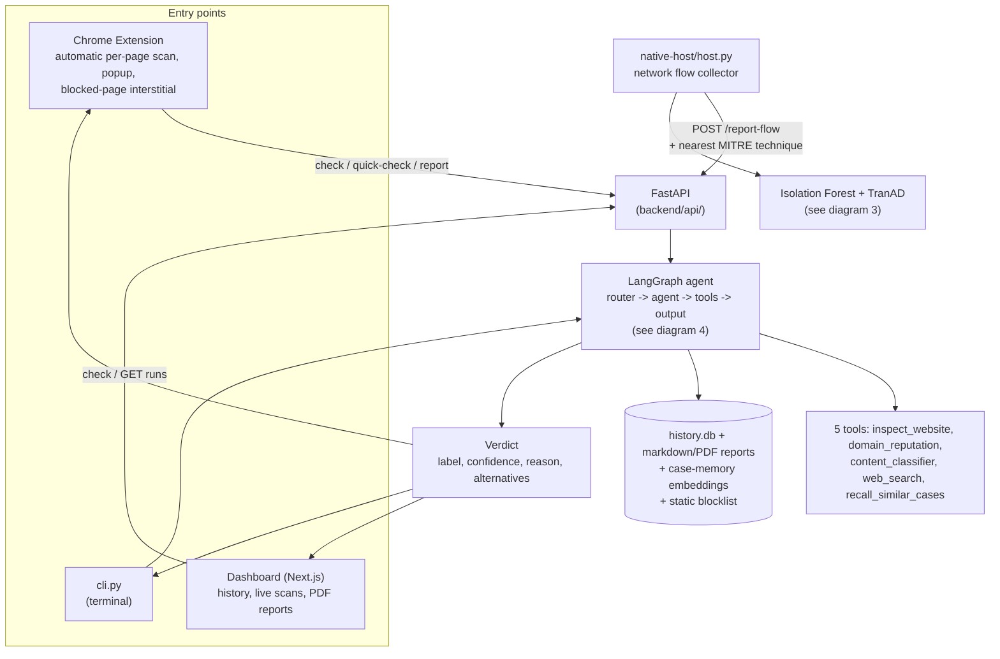
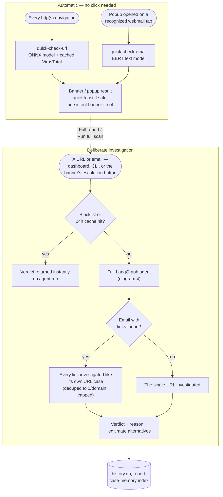
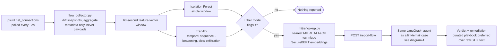
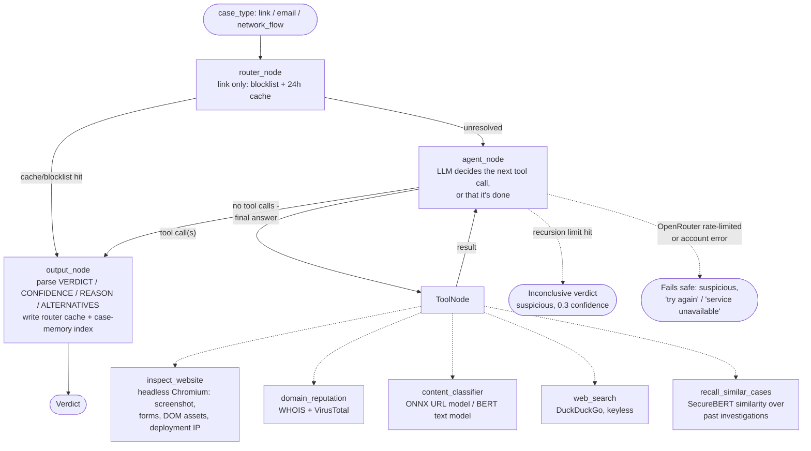

# security-copilot

A personal security assistant with three ways in — a Chrome extension, a web dashboard, and a terminal — all
backed by one [LangGraph](https://github.com/langchain-ai/langgraph) agent. Paste a URL, paste an email, or just
browse normally: a fast local model gives an instant read on everything you visit, and on request the full agent
investigates properly — a real headless-browser sandbox, WHOIS/VirusTotal, DOM and hosting fingerprinting, a
memory of past investigations, and a web search to find the real site if brand impersonation is suspected — then
returns a plain-English verdict: **dangerous / suspicious / safe**, with a confidence score, a reason, and (when
relevant) links to the legitimate site it thinks you meant to visit. The same agent also explains network
anomalies a local traffic monitor flags, in the same plain-English shape.

This is a from-scratch POC, not a production product — see [Status](#status) for what's real vs. in progress.

## What it does

- **Two-tier detection.** Every page you navigate to (and every email you open, from the popup) gets an instant,
  local, no-LLM read first — an ONNX URL model, a BERT text model, a cached VirusTotal lookup. Only when that's
  ambiguous, or you ask for it, does the full agent run. You get instant feedback on everything, and a real
  investigation on demand.
- **Investigates, it doesn't just classify.** The agent decides for itself which tools to call and how deep to
  go — a page that looks fine after one look gets a quick "safe"; a page with a login form on an unfamiliar
  domain gets a screenshot, a WHOIS/VirusTotal check, a DOM/hosting fingerprint, a model score, and sometimes a
  second look at a suspicious link found on the page, before it answers.
- **Reads whole emails, not just their wording.** Every link found in a pasted or opened email gets the exact
  same investigation a standalone URL would — deduplicated to one per domain, capped so it stays bounded. An
  email's own language and its links are treated as two separate signals; either one alone can be enough to call
  the whole email dangerous.
- **Fingerprints the page, not just the URL.** Beyond content, the sandbox checks whether a page's images,
  scripts, and stylesheets are hotlinked from a different (often the real) domain — a common tell for a cloned
  phishing kit — and captures the page's real HTTP response headers and resolved server IP.
- **Remembers.** Every fresh investigation is embedded and added to a similarity index, so a brand-new domain
  using a trick structurally identical to something seen before (a familiar brand-impersonation pattern, hosting
  shape, or evasion trick) can be recognized even when nothing about the literal URL matches anything on a
  blocklist yet.
- **Catches brand impersonation.** If a domain embeds a well-known brand name in a way that isn't that brand's
  real site (`wmw-google-com.loca.lt`), the agent searches for the real company and surfaces its actual site(s)
  alongside the verdict.
- **Reports outward instead of attacking back.** A confirmed-dangerous URL can be reported with one click:
  added to this tool's own blocklist (enforced immediately, including blocking the tab's navigation with an
  interstitial page) and submitted to VirusTotal with a malicious vote — the legal, effective alternative to
  "hacking back."
- **Explains itself, never leaks internals.** Every verdict is a few plain sentences citing what the tools
  actually showed — never a tool or vendor name, just what was actually found.
- **Every check is recorded.** A local SQLite history + a per-case markdown report (screenshot, redirect chain,
  every tool call) + a polished PDF export from the dashboard — all browsable from the dashboard or `GET /runs`.
- **Watches your network too.** A local helper aggregates this machine's connection metadata (never packet
  contents) into 60-second windows and scores each with two unsupervised models — an Isolation Forest (single
  window) and TranAD (the temporal sequence, catching beaconing / slow exfiltration a single window misses). A
  flow that either model flags is mapped to the nearest MITRE ATT&CK technique (SecureBERT embeddings) and sent
  through the *same* agent, so a suspicious flow gets the same explained verdict + remediation as a bad link.

## Architecture

Four views of the same system, from the outside in: the whole thing, how a phishing check actually gets decided,
how a network anomaly gets there, and what the agent itself does internally.

### 1. Complete architecture



### 2. Phishing detection flow

The two-tier strategy in full: what happens automatically with no click, and what happens when you (or the
automatic scan) decides a real investigation is worth it.



### 3. Network anomaly detection



### 4. LangGraph agent flow



Full breakdown of every backend file: [backend/README.md](backend/README.md).

## Quick start

**1. Install** (one-time):

```bash
git clone https://github.com/VatsalMehta-0523/sentinelai-cyber-security.git
cd sentinelai-cyber-security
./download_everything.bash    # venv, Python deps, Playwright's Chromium,
                               # warms the ML model cache, extension npm install + build
```

**2. Add your key** — edit `backend/.env`, set `OPENROUTER_API_KEY` (see below):

```bash
$EDITOR backend/.env
```

**3. Run everything:**

```bash
./run_all.bash                 # backend + native network helper + dashboard
```

On its first run `run_all.bash` also trains the network-anomaly models and builds the MITRE ATT&CK index if
they're missing (the index step downloads ~500MB once — see [below](#network-anomaly-detection-local-traffic)),
and installs the dashboard's dependencies. Subsequent runs skip straight to launching everything. Don't need live
network monitoring? Use `./start_all.bash` instead (backend + dashboard only), or add `WITH_NATIVE_HOST=0` /
`WITH_DASHBOARD=0` to either script to drop just one piece.

Open **http://localhost:3000/** for the dashboard (history, reports, live scans), or use the CLI:

```bash
source .venv/bin/activate && cd backend
python cli.py link https://example.com
python cli.py email    # paste text, then Ctrl-D
```

**API keys:**
- `OPENROUTER_API_KEY` — required, the agent's LLM (via OpenRouter, an OpenAI-compatible gateway to many
  models). Get a key at https://openrouter.ai/keys. The default model is `openai/gpt-oss-120b` — reliable at
  tool calling (which the agent needs). Change `OPENROUTER_MODEL` to any tool-calling model at
  https://openrouter.ai/models. If OpenRouter rate-limits the key (429) or rejects it at the account level (402
  out of credits, 401/403 invalid key), the case fails safe to a low-confidence "suspicious, unresolved" verdict
  instead of crashing.
- `VT_API_KEY` — optional, VirusTotal lookups in `domain_reputation` and the "Report & block" action. Degrades
  gracefully if unset. Free: https://www.virustotal.com/gui/join-us

### Manual setup (if you'd rather not run the scripts)

```bash
python3 -m venv .venv && source .venv/bin/activate   # venv lives at the repo root
pip install torch --index-url https://download.pytorch.org/whl/cpu   # or the cu128 index for a CUDA GPU
pip install -r backend/requirements.txt
playwright install chromium
cd backend && cp .env.example .env   # then fill in OPENROUTER_API_KEY
uvicorn api.app:app --reload --port 8010

# In another terminal, the dashboard:
cd dashboard && pnpm install
NEXT_PUBLIC_API_BASE_URL=http://localhost:8010 pnpm dev
```

### Startup scripts, at a glance

| Script | What it does |
|---|---|
| `download_everything.bash` | One-time setup: repo-root venv, Python deps, Chromium, ML model cache, extension build. |
| `run_all.bash` | Starts **everything**: backend + native network helper + dashboard. Trains models / builds the MITRE index on first run. |
| `start_all.bash` | Starts the backend + dashboard, **without** the native network helper (no live network monitoring). |

All three expect the venv at `.venv/` in the repo root (not inside `backend/`) — that's what `download_everything.bash` creates.

## Load the Chrome extension

1. Make sure the backend is running first (`./start_all.bash`, or the manual steps above).
2. `cd extension && npm install && npm run build` (already done for you by `download_everything.bash`).
3. Open `chrome://extensions`, enable **Developer mode** (top right).
4. Click **Load unpacked**, select `extension/dist/`.
5. Browse normally — every `http(s)://` navigation gets an automatic, instant, local check (no LLM call): a
   quiet toast if it looks fine, a persistent in-page banner if it doesn't, with a **Full report** button to
   trigger a real investigation.
6. Click the security-copilot icon in the toolbar for the popup:
   - **Check this URL** — a full investigation of the current page's URL.
   - **Check page text** — grabs the visible page text and every real link on the page and checks them (works
     on any webapp).
   - On a recognized webmail tab (Gmail, Outlook web, Yahoo Mail, Proton Mail), the popup automatically runs a
     quick phishing read on the open email the moment it's opened, with a **Run full scan** button that
     investigates the email's language *and* every link in it.
7. On a confirmed-dangerous verdict, **Report & block** adds the domain to this tool's own blocklist (future
   navigations to it are redirected to a warning page instead of loading) and reports it to VirusTotal.

If your backend isn't on `http://127.0.0.1:8010`, change it in the extension's Settings (gear icon in the
popup). Extension-specific details: [extension/README.md](extension/README.md).

## Dashboard

A Next.js app (`dashboard/`) separate from the backend — history, live scans, and full run detail pages, with a
"Report & block" action and a one-click, client-generated PDF report (verdict, findings, screenshot, VirusTotal
breakdown) in place of a raw markdown download. Light and dark themes persist across navigation. Every run's
detail page shows exactly what the agent found: the sandboxed screenshot, forms and where they submit to, DOM
asset-hotlinking and hosting signals, the VirusTotal breakdown, and any similar past investigations the
case-memory index recalled.

## Network anomaly detection (local traffic)

The native helper (`native-host/host.py`) is a plain long-running Python process — no Chrome native-messaging
protocol, it just POSTs to the backend like everything else. Its loop (diagram 3 above):

1. **Collect** (`backend/network/flow_collector.py`) — polls `psutil.net_connections` every ~2s, diffs snapshots,
   and aggregates connection **metadata only** (never payloads) into 60-second feature-vector windows.
2. **Score** — each window through two unsupervised models:
   - **Isolation Forest** (`backend/network/isolation_forest.py`) — scores a single window; escalates above the
     99th-percentile-of-normal threshold.
   - **TranAD** (`backend/network/tranad.py`) — a transformer that scores the *sequence*, catching temporal
     patterns (beaconing, slow exfiltration) whose individual windows look normal.
   A window escalates if **either** model flags it.
3. **Report** — the flow's description is mapped to the nearest MITRE ATT&CK technique
   (`backend/mitre/lookup.py`, SecureBERT embeddings) and POSTed to `/report-flow`, which runs it through the
   same agent and returns an explained verdict + remediation (curated playbook text where available).

`run_all.bash` starts this helper for you. To run it on its own (backend must already be up):

```bash
source .venv/bin/activate
python native-host/host.py --backend-url http://127.0.0.1:8010
```

### Training the models / building the index

`run_all.bash` does this automatically on first run; to (re)build them by hand:

```bash
source .venv/bin/activate && cd backend

# Isolation Forest — per-row (labeled datasets) and windowed (live scoring):
python ../scripts/train_isolation_forest.py                       # csv/per-row model
python ../scripts/train_isolation_forest.py --feature-set window  # windowed model
# TranAD temporal model:
python ../scripts/train_tranad.py
# MITRE ATT&CK index (SecureBERT embeddings — downloads ~500MB the first time):
python -m mitre.build_index
```

The bundled sample CSVs (`backend/data/network_datasets/`) are 200-row smoke-test samples. For real detection
quality, retrain against the full [CICIDS2017](https://www.unb.ca/cic/datasets/ids-2017.html) or
[NSL-KDD](https://www.unb.ca/cic/datasets/nsl.html) via `--input <your.csv>`.

### Demo triggers

Generate a network anomaly on cue instead of waiting for real traffic to do something interesting:

```bash
source .venv/bin/activate
# Guaranteed: POST one hand-crafted anomalous flow straight to /report-flow
python scripts/staged_flow_trigger.py post --backend-url http://127.0.0.1:8010
# Live: open a burst of failed outbound connections for the running helper to catch
python scripts/staged_flow_trigger.py live
# Replay pre-recorded CICIDS2017 attack flows through the pipeline
python scripts/replay_attack_flow.py --backend-url http://127.0.0.1:8010
```

## Repository layout

```
backend/        FastAPI + LangGraph agent, network models (network/), MITRE mapping (mitre/), case-memory
                (memory/). Flat, one file per concern — see backend/README.md for the full tree.
dashboard/      Next.js dashboard (history, live scans, run detail pages, PDF export). Talks to the backend
                over the same API the extension uses.
extension/      Chrome MV3 extension: automatic per-navigation quick scan, popup, in-page banner, and a
                blocked-page interstitial for reported/blocklisted domains.
native-host/    The local network helper (host.py) — collects flows, scores with Isolation Forest + TranAD,
                POSTs anomalies to /report-flow.
scripts/        Utilities: train_isolation_forest.py, train_tranad.py, and the demo triggers
                (staged_flow_trigger.py, replay_attack_flow.py).
download_everything.bash   One-time setup: venv, deps, Playwright, ML model cache, extension build.
run_all.bash               Starts everything: backend + native helper + dashboard (trains models / builds MITRE on 1st run).
start_all.bash             Starts the backend + dashboard (port-safe — refuses to clobber something already listening).
```

## Status

**Real and tested end-to-end:** the agent (all 5 tools), the router's blocklist/cache fast path, the CLI, the
FastAPI backend, the Next.js dashboard (history, filters, run detail pages, PDF export, theme persistence), run
history + markdown/PDF reports, DOM asset-hotlinking + deployment fingerprinting, the case-memory recall index,
"Report & block" (blocklist enforcement + VirusTotal submission), and the Chrome extension's automatic
per-navigation quick scan + popup + blocked-page interstitial — all verified against live services (OpenRouter,
VirusTotal, WHOIS, DuckDuckGo, real phishing test sites) and, for the extension, loaded into real Chrome.

**Also built and verified:**
- `backend/network/` — flow collection (`flow_collector.py`), the Isolation Forest (per-row + windowed, with a
  persisted percentile threshold), and TranAD temporal detection. Verified: TranAD flags a synthetic
  slow-exfiltration / beaconing sequence the Isolation Forest misses, with no false positives on normal traffic.
- `backend/mitre/` — SecureBERT + MITRE ATT&CK index (`build_index.py`) and nearest-technique lookup
  (`lookup.py`), with curated playbook remediation text preferred over raw STIX.
- `native-host/host.py` — the local network helper, POSTing anomalies to `/report-flow`.

**In progress:** multi-link email phishing investigation — extracting every link from an email (regex over the
text, plus real DOM hrefs from the extension) and investigating each one the same way a standalone URL case
would, instead of relying on the model to notice links in unstructured text. The backend pieces (extraction,
dedup, the agent's per-link investigation prompt, a fast BERT-only `/quick-check-email`, a streaming
`/check-email-stream`, and graceful degradation if the LLM provider is unavailable) are in place and the
deterministic parts are directly tested; full agent-driven verification and the extension-side wiring (automatic
popup quick-check on webmail tabs, the "Run full scan" flow) are not yet fully verified end-to-end.

**Not built (by design):** per-user personalization — periodically retraining the network models on *your*
logged traffic (excluding confirmed-malicious flows) instead of the public datasets. This is an ongoing task that
only begins after the helper has been running for a few weeks; see the phased plan for details.

## License

Provided as-is for evaluation/demo purposes.
